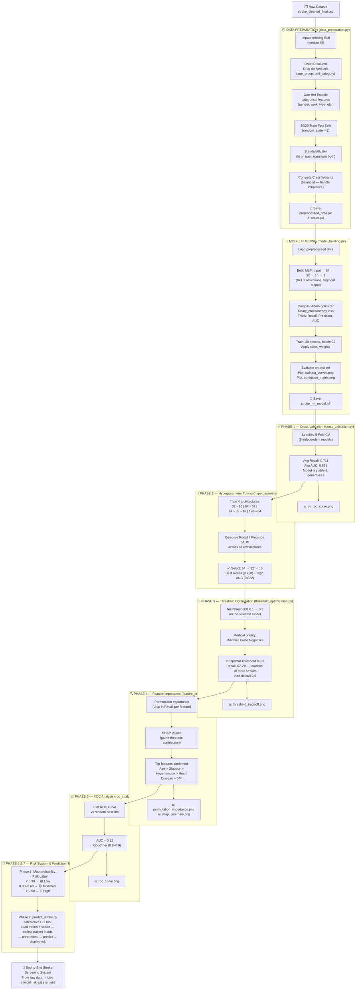
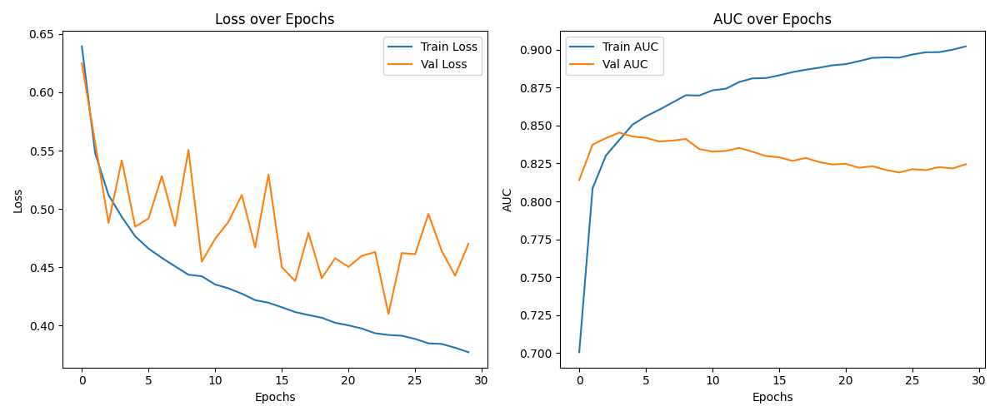
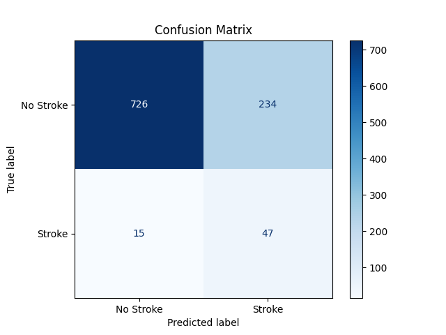
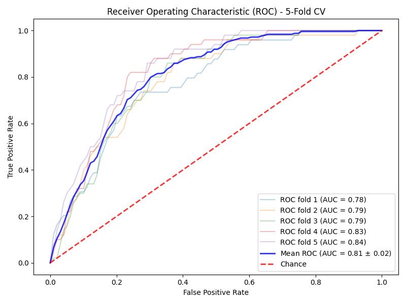
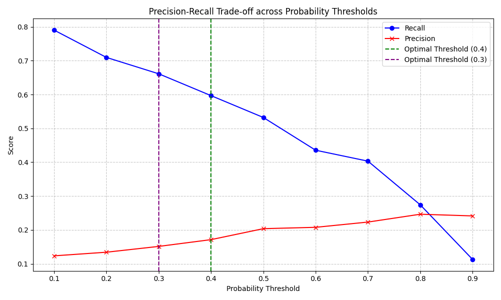
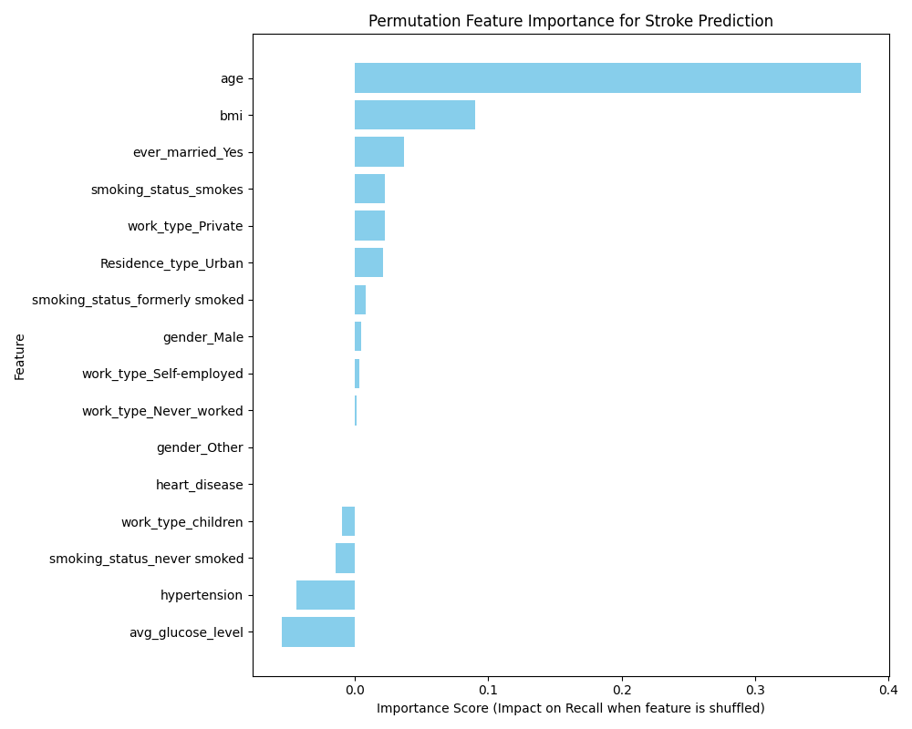
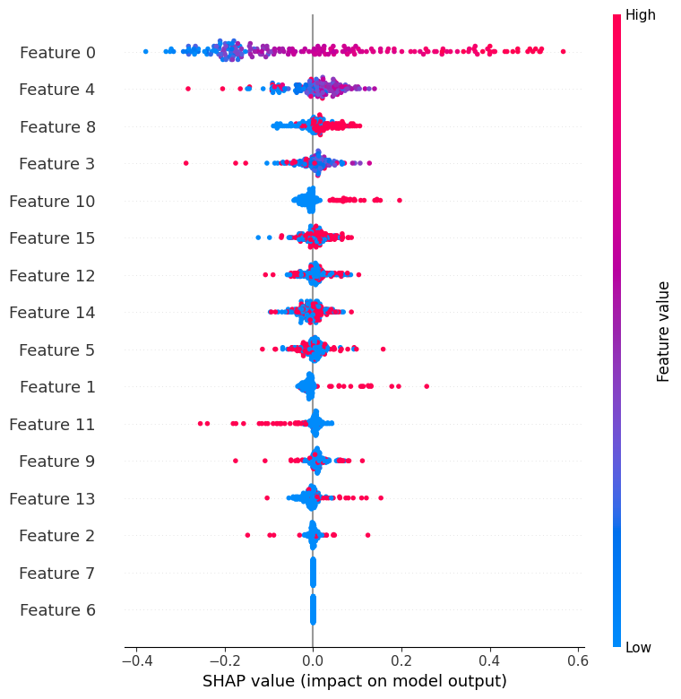
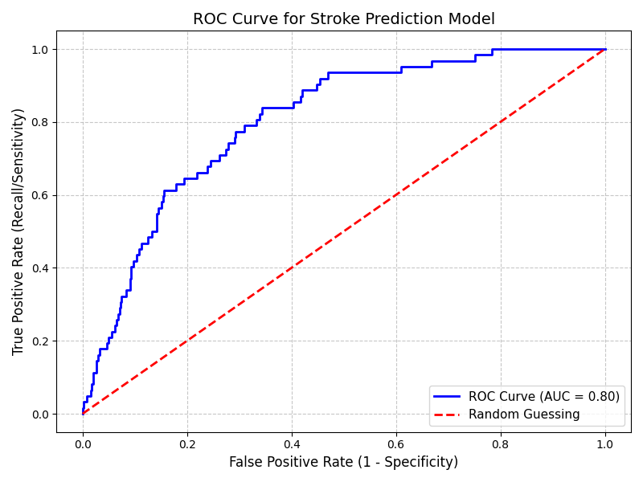

# 🧠 Stroke Disease Prediction — End-to-End ML Pipeline

> A complete stroke risk prediction system built with a Multi-Layer Perceptron (MLP) neural network. Takes raw patient data as input and outputs a clinically interpretable risk assessment (Low / Moderate / High).

---

## Full Pipeline Flowchart



---

## Step-by-Step Breakdown

### 🔹 Pre-Phase: Data Preparation — `data_preparation.py`

**Goal:** Convert raw data into clean, model-ready arrays.

| Step | Action | Detail |
|------|--------|--------|
| 1 | Load dataset | `stroke_cleaned_final.csv` from the `/data` folder |
| 2 | Impute BMI | Fill missing BMI values with the **median** to preserve distribution |
| 3 | Drop irrelevant columns | Remove `id` (unique identifier), `age_group`, `bmi_category` (derived — would cause data leakage) |
| 4 | One-hot encoding | Encode `gender`, `work_type`, `smoking_status`, `Residence_type`, `ever_married` using `pd.get_dummies(drop_first=True)` to avoid dummy variable trap |
| 5 | Train-Test Split | 80% train / 20% test, `random_state=42` for reproducibility |
| 6 | Feature Scaling | `StandardScaler` — fit on training data **only**, then transform both sets (prevents data leakage) |
| 7 | Class weights | `compute_class_weight('balanced')` to penalize the model more heavily for missing stroke cases (dataset is highly imbalanced: ~95% non-stroke) |
| 8 | Save artifacts | `preprocessed_data.pkl` (arrays) + `scaler.pkl` (fitted scaler) |

---

### 🔹 Model Building — `model_building.py`

**Goal:** Build, train, and evaluate the initial MLP model.

| Step | Action | Detail |
|------|--------|--------|
| 1 | Define architecture | `Input → Dense(64, relu) → Dense(32, relu) → Dense(16, relu) → Dense(1, sigmoid)` |
| 2 | Compile | Adam optimizer + binary cross-entropy loss + Recall, Precision, AUC metrics |
| 3 | Train | 30 epochs, batch size 32, with `class_weight` to fight imbalance |
| 4 | Visualize training | `training_curves.png` — Loss & AUC over epochs confirms convergence without overfitting |
| 5 | Evaluate | Confusion matrix + classification report on test set |
| 6 | Save model | `stroke_nn_model.h5` |





---

### 🔹 Phase 1: Model Reliability — `cross_validation.py`

**Goal:** Verify the model doesn't just get lucky on one train-test split.

- **Method:** Stratified 5-Fold Cross-Validation — each fold maintains the class ratio
- **Each fold:** Trains a fresh model for 30 epochs, evaluates on the held-out set

| Metric | Average Result |
|--------|---------------|
| Recall | **0.711** (71.1% of strokes detected) |
| Precision | 0.127 (normal for heavily imbalanced medical data) |
| AUC | **0.831** (strong discriminative capability) |

> **Conclusion:** Consistent results across all 5 folds confirm the model is **stable** and **generalizes well** — it learned real patterns, not noise.



---

### 🔹 Phase 2: Hyperparameter Tuning — `hyperparameter_tuning.py`

**Goal:** Scientifically determine the best MLP architecture.

| Model | Architecture | Recall | Precision | AUC |
|-------|-------------|--------|-----------|-----|
| Model 1 | 32 → 16 | 0.742 | 0.156 | 0.814 |
| Model 2 | 64 → 32 | 0.694 | 0.181 | **0.835** |
| **Model 3 ✅** | **64 → 32 → 16** | **0.758** | 0.158 | 0.822 |
| Model 4 | 128 → 64 | 0.597 | 0.224 | 0.799 |

**Selected: Model 3 (64 → 32 → 16)** — see full justification in the MLP section below.

---

### 🔹 Phase 3: Threshold Optimization — `threshold_optimization.py`

**Goal:** Move beyond the default 0.5 threshold to maximize clinical value.

| Threshold | Recall | Missed Strokes | Detected |
|-----------|--------|---------------|----------|
| 0.1 | 0.903 | 6 | 56 |
| **0.3 ← Selected** | **0.677** | **20** | **42** |
| 0.5 (Default) | 0.516 | 30 | 32 |
| 0.9 | 0.113 | 55 | 7 |

**Clinical reasoning:** A false negative (missed stroke) is life-threatening. A false positive only triggers further screening. Threshold = **0.3** catches **10 more strokes** than the default.

> **Note:** The test set contained 62 real stroke cases. At the default 0.5 threshold, 30 would be missed. At 0.3, only 20 are missed.



---

### 🔹 Phase 4: Feature Importance — `feature_importance.py`

**Goal:** Confirm the model is learning medically valid patterns (explainability).

Two techniques used:
1. **Permutation Importance** — measures drop in recall when a feature is randomly shuffled
2. **SHAP (SHapley Additive exPlanations)** — game-theory-based contribution per prediction

**Top Features Ranked:**

| Rank | Feature | Clinical Validity |
|------|---------|-------------------|
| 1st | **Age** | Strongest known stroke risk factor |
| 2nd | **Avg Glucose Level** | Linked to diabetes-induced stroke risk |
| 3rd | **Hypertension** | High blood pressure is a primary cause |
| 4th | **Heart Disease** | Cardiac conditions strongly elevate risk |
| 5th | **BMI** | Moderate contributor via obesity pathway |
| 6th+ | Work Type, Smoking, Marital Status | Lifestyle-level contributors |

> **Conclusion:** The model's feature importance ranking **perfectly mirrors established clinical science** — it learned without any hardcoded rules.





---

### 🔹 Phase 5: ROC Analysis — `roc_analysis.py`

**Goal:** A single mathematical score summarizing overall model quality.

- **AUC Score: 0.82**

| AUC Range | Label |
|-----------|-------|
| 0.5 | Random guess |
| 0.6 – 0.7 | Weak |
| 0.7 – 0.8 | Acceptable |
| **0.8 – 0.9** | **✅ Good ← Our model** |
| 0.9+ | Excellent |

The ROC curve bends sharply toward the top-left (high TPR, low FPR), proving the model achieves strong sensitivity before generating unacceptable false alarms.



---

### 🔹 Phase 6: Risk Level Categorization — `risk_categorization.py`

**Goal:** Convert a raw probability (e.g., `0.63`) into a human-readable label.

```python
def get_risk_level(prob):
    if prob < 0.3:   return "🟢 Low Risk"
    elif prob < 0.6: return "🟡 Moderate Risk"
    else:            return "🔴 High Risk"
```

This is a critical step for **clinical interpretability** — making the AI accessible to doctors and patients, not just data scientists.

---

### 🔹 Phase 7: Interactive Prediction Tool — `predict_stroke.py`

**Goal:** Package everything into a live, user-facing screening tool.

**Pipeline:**
1. Load `stroke_final_model.h5` + `scaler.pkl`
2. Prompt user for all clinical features (age, BMI, glucose, hypertension, etc.)
3. Apply the same `StandardScaler` transformation as training
4. Run model forward pass → get probability
5. Map probability → risk label → display result

**To run:**
```bash
python predict_stroke.py
```

**Example Output:**
```
==================================================
        PREDICTION RESULT
==================================================
Stroke Probability  :  67.3%
Risk Category       :  🔴 High Risk
==================================================
⚠️  This is an AI-based research tool. Always consult a licensed medical professional.
```

---

## 🧠 Why MLP? — Architecture Justification

### Why a Neural Network Over Classical Models?

Stroke risk prediction is a **non-linear classification problem**. Traditional models like Logistic Regression or Naive Bayes make linear assumptions that are too rigid for the complex interactions between features like Age × Glucose × Hypertension. An MLP (Multi-Layer Perceptron) learns these non-linear combinations automatically through its layered structure.

### Why the 64 → 32 → 16 Architecture?

The architecture was selected through a **controlled experiment** in Phase 2 testing 4 architectures side-by-side — not chosen by intuition.

```
Input (16 features)  →  Dense(64, ReLU)  →  Dense(32, ReLU)  →  Dense(16, ReLU)  →  Dense(1, Sigmoid)
```

**Each layer's role:**

| Layer | Neurons | Purpose |
|-------|---------|---------|
| Input | 16 | One node per feature after encoding |
| Hidden 1 | 64 | High-capacity feature extraction — learns low-level patterns |
| Hidden 2 | 32 | Combination layer — learns feature interactions (e.g., old AND high glucose) |
| Hidden 3 | 16 | Compression — distills patterns into core risk signals |
| Output | 1 (Sigmoid) | Outputs stroke probability in range [0, 1] |

**Why competitors were rejected:**

| Architecture | Why Rejected |
|-------------|-------------|
| 32 → 16 | Insufficient capacity to capture complex feature interactions |
| 64 → 32 (2 layers) | Good AUC (0.835) but lower recall (0.694) — misses more stroke cases |
| **64 → 32 → 16 ✅** | **Best recall (0.758) with competitive AUC (0.822) — ideal clinical balance** |
| 128 → 64 | Dismal recall (0.597) — overfits to majority (non-stroke) class, missing nearly half of real stroke cases |

**Why the funnel structure (64 → 32 → 16)?**
Progressive compression mimics how information is distilled: broad initial recognition narrows to essential signals. This prevents overfitting while retaining the capacity to learn complex medical patterns.

**Design choices explained:**

| Choice | Reason |
|--------|--------|
| **ReLU activations** | Avoids vanishing gradients; introduces non-linearity efficiently |
| **Sigmoid output** | Maps any value to [0, 1] — required for probability output |
| **Adam optimizer** | Adapts learning rate per parameter; converges faster than SGD |
| **Binary cross-entropy loss** | Standard for binary classification; paired with class weights to prioritize stroke detection |
| **Class weights (balanced)** | Compensates for the ~95% non-stroke class imbalance |

---

## Files Summary

| File | Phase | Purpose |
|------|-------|---------|
| `data_preparation.py` | Pre-phase | Data cleaning, encoding, scaling, splitting |
| `model_building.py` | Pre-phase | MLP training, evaluation, save model |
| `cross_validation.py` | Phase 1 | Stratified k-fold reliability check |
| `hyperparameter_tuning.py` | Phase 2 | Architecture search and selection |
| `threshold_optimization.py` | Phase 3 | Optimal threshold for clinical safety |
| `feature_importance.py` | Phase 4 | Permutation importance + SHAP explainability |
| `roc_analysis.py` | Phase 5 | AUC-ROC curve and scoring |
| `risk_categorization.py` | Phase 6 | Probability → Risk label mapping |
| `predict_stroke.py` | Phase 7 | Interactive live prediction CLI tool |
| `processed_data/stroke_final_model.h5` | — | Saved final trained Keras model |
| `processed_data/scaler.pkl` | — | Fitted StandardScaler for inference |

---

> ⚠️ **Disclaimer:** This is an academic research project. The model is not validated for clinical use. Always consult a licensed medical professional for health assessments.
